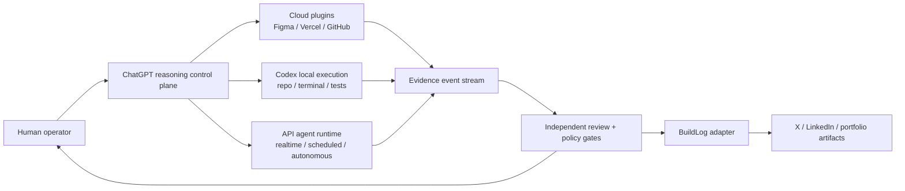

# SoloScale AI OS

> **Working title:** a human-controlled AI operating system for routing reasoning, cloud plugins, local coding, and runtime agents.

**One strong reasoning core. Many execution surfaces. Deterministic evidence.**

SoloScale AI OS is both:

1. a **personal AI operating system** that routes work across ChatGPT Chat, connected plugins, Codex, and human approval; and
2. an **agent orchestration runtime** that can later automate the same workflow through APIs, Codex SDK, sandboxes, queues, and cloud workers.

The project is deliberately not a six-agent debate club. It uses the smallest number of bounded roles that produce independent value:

- **Reasoner / Planner** — defines the problem, freezes decisions, and creates an execution contract.
- **Executor** — modifies code or invokes tools inside a constrained environment.
- **Reviewer** — independently checks evidence, diffs, tests, and policy compliance.
- **Human gate** — approves risky, expensive, public, or irreversible actions.

## Why this exists

Modern AI tools are often used as isolated chat boxes. The same context gets re-explained to multiple models; coding agents spend expensive turns rediscovering product decisions; development evidence disappears after the code works; and content starts from a blank prompt rather than real engineering work.

SoloScale treats the workflow as a system:



## Two operating modes

### Personal mode

Use the paid ChatGPT product as the control plane:

```text
ChatGPT Chat
  → research, product thinking, architecture, trade-offs, final review

Plugins
  → cloud actions in Figma, Vercel, GitHub, and other connected systems

Codex
  → only work that requires local files, terminal state, tests, builds, or Git

Human
  → budget, production, public posting, security, and irreversible decisions
```

The bridge between Chat and Codex is not raw conversation history. It is a compact, versioned **Execution Packet** committed to GitHub or attached to an Issue.

### Runtime mode

When latency, scheduling, or autonomy matters, replace the manual Chat surface with API-backed roles while preserving the same contracts:

```text
Task Envelope
  → deterministic router
  → planner
  → approval gate
  → Codex executor
  → deterministic verification
  → independent reviewer
  → repair loop
  → final evidence package
```

## Current scope: v0.2

v0.1 established the deterministic workflow and Casebook foundations:

- typed Task Envelope
- route classification: `CHAT`, `PLUGIN`, `CODEX`, `RUNTIME`, `HUMAN`
- guarded state transitions
- append-only JSONL run events with from/to state and evidence receipts
- persisted run/task continuity checks before every transition
- approval-receipt enforcement before every `EXECUTING` transition
- Markdown Execution Packet generation
- BuildLog-compatible evidence export
- private Casebook evidence archives with SHA-256 integrity receipts
- append-only interview practice attempts; passing gates require integrity receipts
- deterministic interview packets and a local Control Tower
- GitHub Issue Forms and PR template
- CI and unit tests
- content/narrative templates

v0.2 adds a private Conversation RAG slice:

- defensive adapters for the locally observed Codex JSONL format and
  operator-supplied ChatGPT exports;
- a narrow BuildLog boundary over three narrative Markdown files plus schema-specific safe
  projections of events, plans, evaluations, run metadata, and timelines;
- a private, idempotent SQLite knowledge index with FTS and metadata rank fusion;
- a custom, code-controlled bounded Evidence Agent that can use an already-running local
  Ollama model; and
- exact model-visible excerpt receipts, citation checks, explicit gaps, and a human
  promotion gate.

SoloScale still does **not** use a ChatGPT subscription as an API, scrape a signed-in
account, invoke Codex/Vercel/Figma as a runtime, or call a paid API. Sync, status, reset,
and deterministic search do not call a model or network service.

## Quick start

```bash
python3 -m venv .venv
source .venv/bin/activate
pip install -e '.[dev]'

soloscale demo
pytest
```

### 个人本地端（最小版）

```bash
python -m soloscale.local_ui

# 可选
python -m soloscale.local_ui --host 127.0.0.1 --port 8765 --data-root .soloscale
```

打开终端打印的地址（默认 `http://127.0.0.1:8765`）。

### Resume Intelligence Workspace v0.1

The local UI now includes a bounded Resume Workspace: JD + operator-supplied Candidate
Profile + direct local KnowledgeStore evidence candidates produce a one-page draft,
explicit gaps, and a clickable Skill–Evidence graph. Each run is private under
`.soloscale/resume-runs/<run-id>/` with nine inspectable artifacts. `Local-only` performs
no network call. `Hybrid` is intentionally only a provider interface in v0.1; it does not
send local evidence or Candidate Profile data to any service.

The local UI also writes an application-facing bundle to the configurable Resume Library
Root, which defaults to `~/Documents/Resume Applications`. Each non-overwriting application
directory keeps `JD.md`, the generated Markdown resume, and `application.json` together.
The complete internal evidence/graph/verification artifacts remain in `.soloscale`; the
external library receives only the application-facing bundle. DOCX template export remains
a separate manual step in v0.1.

Create and route a task:

```bash
soloscale task-create \
  --title "Add source-grounded citations to the Research Agent" \
  --goal "Every research claim must link to inspectable source evidence" \
  --repo "../AI-Research-Assistant-LangJu-Edition" \
  --branch "feat/source-grounded-citations" \
  --constraint "Preserve the existing user-facing workflow" \
  --frozen-decision "Missing source evidence must never be invented" \
  --required-change "Return structured source receipts" \
  --acceptance-criterion "Every claim has inspectable evidence" \
  --test-to-run "pytest" \
  --reasoning-depth high \
  --requires-local \
  --latency-tolerance batch

soloscale task-route .soloscale/tasks/<task-id>/task.json
```

Generate a Codex handoff packet:

```bash
soloscale packet-create .soloscale/tasks/<task-id>/task.json
```

Export an engineering iteration for the existing BuildLog project:

```bash
soloscale buildlog-export .soloscale/tasks/<task-id>/run-summary.json
```

### Preserve a case and practice it

Casebook keeps selected evidence private under ignored `.soloscale/` storage. It does
not scrape an account, send files to an API, or embed raw evidence in generated views.

```bash
soloscale case-create \
  --case-id source-grounded-citations \
  --title "Adding citations without breaking a legacy AI assistant" \
  --project "AI Research Assistant" \
  --problem "Retrieved evidence had no strict public citation contract." \
  --expected "Answers expose validated provenance without changing legacy callers." \
  --actual "The legacy response exposed only text and no inspectable source contract." \
  --root-cause "Generation and public provenance were not joined by one validated contract." \
  --resolution "Add a structured API over shared orchestration and preserve the legacy API." \
  --verification "70 local tests and all post-merge main CI jobs passed." \
  --concept "API evolution without duplicate side effects" \
  --concept "Provenance normalization and collision policy" \
  --unknown "Business impact and token cost were not measured." \
  --evidence document=examples/casebook/source-grounded-citations-case.md \
  --evidence ci=examples/casebook/citation-verification.txt

soloscale case-status source-grounded-citations
soloscale control-tower-build
```

The new case starts at `0/5`. Complete a stage with your own non-empty receipt:

```bash
soloscale case-attempt source-grounded-citations \
  --stage explain \
  --outcome pass \
  --receipt path/to/my-unaided-explanation.md \
  --note "Explained the confirmed boundary and unknowns without notes."
```

The five gates are:

```text
Explain → Trace → Rebuild → Debug → Defend
```

Passing all five produces `SELF_ASSESSED_INTERVIEW_READY`; it is deliberately not an
external certification. See [the Casebook guide](docs/casebook.md).

### Search the engineering conversations that produced the evidence

The private knowledge plane scans local Codex sessions defensively and can auto-detect an
enclosing BuildLog checkout. ChatGPT input is always an operator-supplied export. Codex
ingestion selects observed user/assistant message records. For a valid ChatGPT
`current_node`, ingestion follows only its active ancestry and excludes sibling branches;
known hidden-message flags are also filtered. Long messages and artifacts are split into
deterministic overlapping retrieval segments.

BuildLog ingestion indexes the narrative bodies in `ingestion-report.md`, `03_draft.md`,
and `05_final.md`. It also indexes schema-specific safe projections from `events.jsonl`,
`02_plan.json`, `04_evaluation.json`, `run_metadata.json`, and `timeline.json`. Raw prompts,
responses, tool arguments, stdout, stderr, and arbitrary nested payloads remain excluded
from those structured projections. The three narrative Markdown bodies are searchable as
written after best-effort redaction, so they still require operator review.

Control-plane blocks and common credential shapes are removed with best-effort filters
before persistence. This is not a proof that all sensitive content has been found. Review
source scope and candidate output before promotion or publication.

```bash
# Full selected-source rescans with idempotent snapshot updates.
# Private data stays under ignored .soloscale/.
soloscale knowledge-sync

soloscale knowledge-status
soloscale knowledge-search "SoloScale BuildLog evaluator recovery"
soloscale control-tower-build
```

The Control Tower shows Conversation RAG document/chunk/run counts, current state, and one
deterministic exact next action without embedding conversation bodies or source locators.

ChatGPT does not have a live signed-in-history adapter in this project. Supply an exported
`conversations.json`, or an export ZIP containing it:

```bash
soloscale knowledge-sync \
  --chatgpt-export /private/path/to/chatgpt-export.zip
```

Once an already-installed Ollama model is running locally, the Evidence Agent can plan and
refine searches over that index:

```bash
soloscale evidence-agent \
  "Find the strongest SoloScale and BuildLog incidents for interview practice"
```

The agent has one read-only search tool and fixed query, round, hit, and context budgets.
Its output is a private citation-backed candidate. It cannot confirm Casebook facts,
rewrite BuildLog, update a resume, publish content, or deploy anything. See
[the Conversation RAG guide](docs/conversation-rag.md).

Retrieved text is untrusted. Code limits its possible effects to bounded local search and
verifies that each declared claim cites an in-context chunk from the same run. Prompt
injection, irrelevant citations, and omitted gaps remain possible, so human review is
required.

A synthetic bilingual retrieval-only golden fixture currently records Recall@5 `1.0`,
MRR `1.0`, store neighbor-expansion recall `1.0`, neighbor-expansion forbidden-context
precision `1.0`, and deterministic
repeated/rebuilt rankings. One targeted local run measured a maximum search latency of
`1.863 ms`; this is a single workstation observation, not a percentile or service
commitment. Semantic faithfulness, answer relevancy, and reasoner-output quality are not
evaluated and remain human-gated or future opt-in evaluations.

## Repository map

```text
.
├── README.md                         public product story
├── PROJECT.md                        product and engineering source of truth
├── TASK.md                           current sprint
├── ROADMAP.md                        milestone plan
├── AGENTS.md                         instructions for coding agents
├── src/soloscale/
│   ├── models.py                     contracts
│   ├── router.py                     deterministic route policy
│   ├── state_machine.py              guarded workflow transitions
│   ├── event_store.py                append-only evidence
│   ├── orchestration.py              validated, receipt-backed transitions
│   ├── handoff.py                    Execution Packet
│   ├── buildlog_adapter.py           evidence-to-content bridge
│   ├── casebook_models.py            learning and evidence contracts
│   ├── casebook_store.py             private archives and append-only practice
│   ├── interview_packet.py           deterministic interview exercises
│   ├── control_tower.py              local visual current-state projection
│   ├── knowledge_models.py           conversation/retrieval contracts
│   ├── conversation_intake.py        defensive source adapters and redaction
│   ├── knowledge_store.py             private SQLite/FTS evidence index
│   ├── evidence_agent.py              custom code-controlled Evidence Agent
│   └── cli.py                        local CLI
├── tests/                            deterministic tests
├── examples/                         dogfooding inputs
├── docs/
│   ├── architecture.md
│   ├── decisions/                    ADRs
│   ├── devlogs/                      public development history
│   ├── conversations/                distilled insights, never raw secrets
│   ├── integrations/
│   └── content/                      X / LinkedIn narrative assets
└── .github/
    ├── ISSUE_TEMPLATE/
    ├── PULL_REQUEST_TEMPLATE.md
    └── workflows/ci.yml
```

## Portfolio thesis

This project demonstrates more than prompt engineering:

- human-in-the-loop system design
- deterministic and LLM-driven orchestration trade-offs
- multi-surface tool routing
- structured outputs and contract-driven handoffs
- sandboxed coding-agent execution
- guardrails and approval gates
- observability, replay, and cost accounting
- evaluation and independent review
- evidence-to-content transformation
- local-to-cloud evolution

## Relationship to existing projects

- **SoloScale AI OS** — orchestration and control plane.
- **AI Research Assistant — LangJu Edition** — first real workload used to dogfood the system.
- **BuildLog** — downstream evidence-to-story and publishing system.

Keeping them separate makes each portfolio artifact clearer while creating a compounding ecosystem.

## Project operations

- [SoloScale Execution Manual v1](docs/operating-manual/README.md)
- [GitHub evidence-plane setup](docs/github-project.md)
- [Local-to-cloud and Vercel path](docs/deployment.md)
- [Conversation distillation policy](docs/conversations/README.md)
- [Casebook local evidence and learning workflow](docs/casebook.md)
- [Private Conversation RAG and Evidence Agent](docs/conversation-rag.md)
- [Evidence-to-multichannel content template](docs/content/TEMPLATE.md)
- [Editable Figma architecture board](https://www.figma.com/board/psWfF0mEOdHqUvyOWrJWeF)

Local hardening revision `9fd720b` passed 28 tests, Ruff, `mypy src tests`, the installed CLI demo from outside the repository, and isolated wheel/source-distribution builds. That was the starter baseline: the later Citation Feature completed its external Issue → PR → review → merge → main-CI loop, while this local Casebook branch still requires its own GitHub PR and CI gate.

The current repository remains a local control plane. It does not use a ChatGPT
subscription as an API, invoke plugins or Codex as a runtime, or claim measured efficiency
or commercial demand. Conversation sync can read local Codex transcripts and supplied
ChatGPT exports; it does not scrape accounts, read browser cookies, ingest attachments by
default, or send the private index to a hosted service. Removed source files are not pruned
incrementally in v0.2; `soloscale knowledge-reset --yes` deletes only the derived index and
preserves private Evidence Agent run receipts.

## Public-development rule

Do not publish raw chat transcripts, credentials, private prompts, customer details, or unreviewed claims.

Publish distilled evidence:

```text
problem
→ observation
→ decision
→ alternatives
→ implementation
→ verification
→ result
→ lesson
```

See `docs/conversations/README.md` and `docs/content/`.
