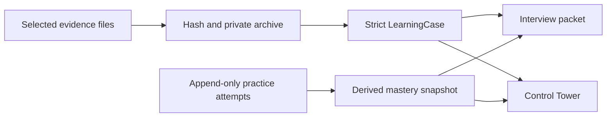
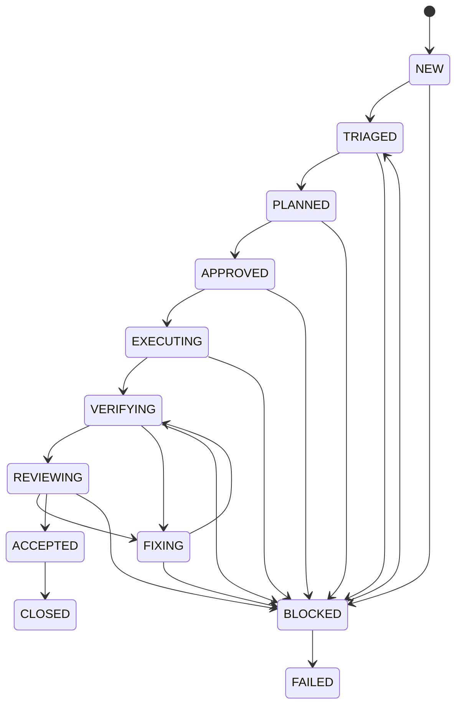
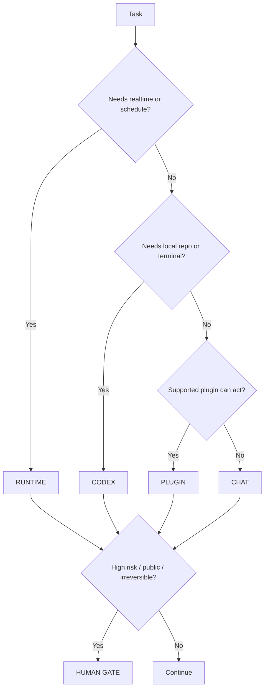

# Architecture

## 1. System boundaries

SoloScale has three related planes with separate execution and trust boundaries.

### Personal control plane

The operator uses ChatGPT Chat and plugins directly. Chat outputs a compact artifact instead of trying to programmatically expose a paid subscription.

### Automated runtime plane

API-backed agents and Codex SDK execute workflows when realtime, scheduled, or unattended operation is required.

Both planes share the same contracts and evidence model.

### Local learning plane

Casebook is a third, local-only projection over deliberately selected evidence. It keeps
the delivery state and the operator's learning state independent:

The JSON case and JSONL attempts are the source of truth. Markdown and HTML are derived
artifacts. Raw evidence bodies are never embedded in those derived views.

## 2. Core contracts

### Task Envelope

Describes the outcome, constraints, required state, latency, risk, and available execution surfaces.

### Route Decision

Selects the primary surface and any secondary roles.

### Execution Packet

Freezes product and architecture decisions before local implementation.

### Run Event

Append-only evidence of each state transition, tool call, command, approval, and result.

### Review Result

Independent findings with severity, evidence, and required remediation.

### BuildLog Iteration

A distilled engineering story grounded in the completed run.

### Learning Case

Operator-confirmed engineering facts plus checksummed evidence receipts. It may state
unknowns explicitly and does not infer facts from transcript content.

### Practice Attempt

An append-only self-assessment for one of Explain, Trace, Rebuild, Debug, or Defend.
Passing attempts require an archived receipt; `needs-work` attempts require an explicit
note and may optionally include one. Mastery status is derived from the latest attempt
for each stage.

## 3. Bounded topology

Blocked work must return through triage before it can be planned and approved again; it cannot jump directly back into planning, fixing, or execution. Failure edges from active states are omitted from the diagram for readability. The repair loop is bounded structurally; a later policy module will enforce retry, time, cost, and file-change budgets.

## 4. Personal-mode routing

## 5. Runtime evolution

### v0.1

Manual Chat, local CLI, GitHub artifacts, BuildLog export.

### v0.2

Codex SDK controls local coding threads. Deterministic verification and bounded repairs.

### v0.3

Agents SDK provides planner/reviewer roles. Code controls routing; specialists are tools, not a free-form committee.

### v0.4

Queue workers, sandboxed repositories, persistence, observability, and cloud deployment.
