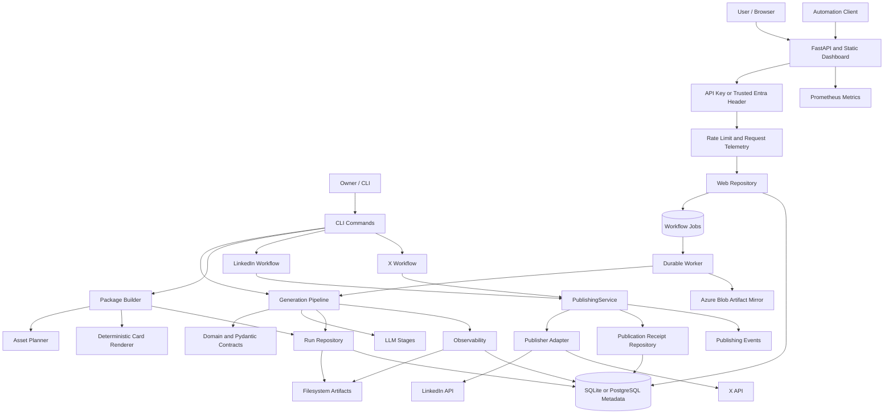
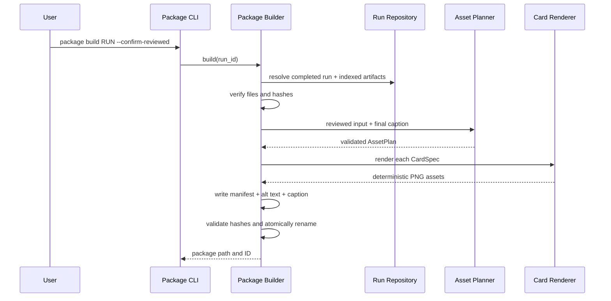
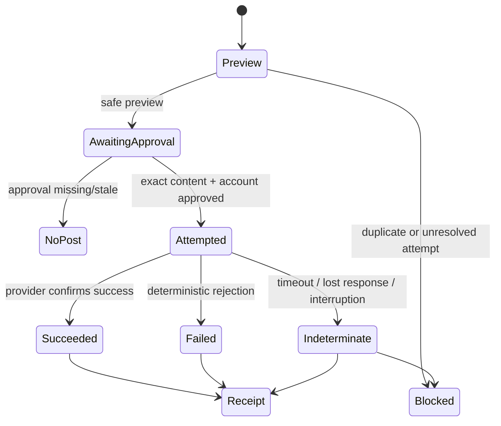

# BuildLog Ownership Handbook

> A developer ownership, interview preparation, and founder decision guide for
> the current BuildLog repository.

**Baseline:** hosted-product and Salesforce interview baseline, 2026-08-02.

**Audience:** the repository owner first; reviewers, interviewers, and future
contributors second.

**Purpose:** make the owner able to explain, trace, change, test, and defend the
system without relying on an AI-generated description.

This handbook describes the repository as it exists at the baseline above. It
does not authorize new product work and it does not claim that every current
choice is the final architecture.

---

## 0. How To Use This Handbook

Do not memorize this document. Use it as a map back to the source.

For each ownership pass at the end of the handbook:

1. Read the named source files.
2. Draw the flow without looking at this document.
3. Explain the design aloud in plain English.
4. Answer the interview questions without saying "the AI chose it."
5. Make one small local change or write one focused test when the pass asks for
   it.
6. Record what you still cannot explain.

An area is owned only when you can:

- state why it exists;
- identify its inputs, outputs, dependencies, and failure modes;
- trace one real request through it;
- explain the main alternative and trade-off;
- change it safely and identify the relevant tests;
- distinguish current evidence from future ambition.

The handbook has two interview jobs:

- **Project Deep Dive:** BuildLog itself is the case. This handbook is the
  primary preparation material.
- **Open-ended System Design:** the interviewer gives a new case. BuildLog is
  useful evidence for decisions, but it is not a template to force onto every
  system.

---

# Part I. Product Ownership

## 1. The One-Sentence Product

> BuildLog turns reviewed engineering evidence into traceable, reviewable
> communication artifacts and optionally delivers approved artifacts through
> narrow platform adapters.

The shortest current value flow is:

```text
Engineering evidence
        -> reviewed engineering story
        -> target-aware artifact or package
        -> human review
        -> optional manual or approved delivery
```

BuildLog is not primarily an OAuth tool, a social-media scheduler, or a generic
LLM writer. LinkedIn and X are current output boundaries. They are not the
product core.

## 2. The User Problem

Software work continuously creates useful material: problems, decisions,
trade-offs, failures, tests, and lessons. Most of that context disappears after
the code is merged. Turning it into accurate public communication takes repeated
manual work and becomes more expensive across channels with different audience
expectations.

BuildLog tries to reduce that repeated cognitive work while preserving:

- evidence grounding;
- explicit human review;
- artifact provenance;
- observable execution;
- safe, optional delivery.

## 3. Current Product Contract

The current repository can:

- validate one structured engineering iteration;
- normalize it deterministically;
- use an LLM to plan, draft, evaluate, and optionally revise once;
- persist readable run artifacts and relational metadata;
- explain a run through events, steps, LLM observations, hashes, and lineage;
- build a LinkedIn-targeted visual package from a reviewed run;
- preview and human-approve a text artifact before delivery;
- deliver text through validated LinkedIn and X adapters;
- persist success, failure, or indeterminate publication receipts;
- block known duplicate or unresolved publication attempts.
- serve an authenticated internal dashboard and versioned REST API;
- accept validated generation jobs with required idempotency keys;
- persist, transactionally claim, retry, recover, and inspect workflow jobs;
- run schema changes through Alembic against SQLite or PostgreSQL;
- expose liveness, database readiness, request metrics, request IDs, and
  security headers;
- mirror completed run artifacts to Azure Blob Storage with content hashes;
- build and deploy through a non-root container, Azure Bicep, and protected
  GitHub Actions environments.

It does **not** currently prove:

- reliable automatic evidence collection;
- stable channel-specific content quality across many real runs;
- autonomous or scheduled publishing;
- application-owned multi-user RBAC or tenant isolation;
- server-side exactly-once delivery;
- a reusable multi-platform Publishing Package contract;
- product-market fit, retention, or willingness to pay.

## 4. Verified, Feasible, and Aspirational

| Level | Meaning | Current examples |
|---|---|---|
| Verified | Real code and evidence demonstrate the claim | Local Qwen pipeline, SQLite/filesystem trace, LinkedIn and X HTTP 201 smoke publishes, 270 automated tests, 500-request in-process API benchmark |
| Implemented but not broadly validated | Code exists; product value, hosted operation, or generality is not proven | FastAPI dashboard, durable SQL jobs, Alembic, container, Azure IaC, Blob mirroring, shared publisher workflow |
| Feasible | A credible implementation path exists | Hosted Azure smoke validation, multi-replica worker deployment, additional publisher adapters |
| Aspirational | Product direction, not a present capability | automatic evidence capture, cross-channel content engine, work-intelligence platform |

An interview answer must preserve these distinctions. Strong engineers reduce
claims to what the evidence supports.

## 5. Core Versus Commodity

BuildLog should own:

- engineering context and evidence boundaries;
- grounding and provenance;
- transformation into reviewed artifacts;
- channel-aware content decisions;
- human review and approval;
- execution trace and publication receipts.

BuildLog should normally reuse:

- foundation models;
- OAuth libraries;
- HTTP clients;
- relational persistence libraries;
- diagram, syntax-highlighting, image, OCR, TTS, and rendering capabilities;
- official platform APIs and SDKs where suitable.

Decision rule:

> BuildLog owns the evidence-aware workflow. Proven tools supply commodity
> capabilities.

---

# Part II. Architecture Ownership

## 6. System Map



## 7. Layer Responsibilities

| Layer | Owns | Must not own |
|---|---|---|
| CLI | parsing, user messages, explicit confirmation, exit behavior | domain decisions, HTTP implementation |
| Application workflow | sequencing use cases and enforcing workflow gates | platform-specific transport details |
| Domain/contracts | validated concepts, records, protocols, invariants | filesystem, ORM sessions, network calls |
| LLM stages | one reasoning responsibility per stage | persistence and publication |
| Persistence | durable metadata, relationships, receipts, projections | content-generation decisions |
| Observability | explanation, timing, events, lineage, reproducibility status | changing business outcomes |
| Package building | reviewed-run resolution, planning, rendering, manifest integrity | publishing or account authentication |
| Authentication adapters | user authorization, token storage, identity resolution | content generation |
| Publisher adapters | one platform transport attempt and response parsing | rewriting, retry policy, approval decisions |
| Web/API | HTTP contracts, authentication gate, validation, request telemetry, health endpoints | LLM reasoning, platform transport |
| Durable worker | job claim, bounded retry, stale recovery, pipeline invocation, artifact mirroring | changing the generation graph |
| Deployment | immutable image, configuration, migrations, probes, managed-service wiring, rollback | product policy or fabricated reliability claims |

## 8. Stable Vocabulary

### Core workflow concepts

| Concept | Meaning |
|---|---|
| Iteration | One structured unit of engineering work and its evidence-bearing narrative input |
| Run | One execution of the BuildLog generation pipeline with fixed recorded configuration |
| Artifact | A persisted input, intermediate, final, package, or trace output |
| Evaluation | Structured assessment of one generated draft |
| Prompt Version | Identifiable external prompt content used by an LLM stage |
| Publishing Package | A target-aware local bundle of caption, visual assets, alt text, and manifest; currently LinkedIn-specific |
| Publication Receipt | Durable evidence of one client-side publication attempt and its known result |

### Supporting concepts

- `EvidenceReference` is a future-facing value-object concept, not yet a broad
  source-ingestion system in this codebase.
- Observation records are projections of execution facts, not business entities.
- ORM rows are storage models, not automatically domain entities.
- LinkedIn and X are adapters at the system boundary, not core domain concepts.

## 9. Repository Layout

```text
src/buildlog/       product code
prompts/            versioned external prompt files
tests/              deterministic, integration-style, and adapter tests
migrations/         Alembic schema history
infra/azure/        Azure Container Apps, PostgreSQL, Blob, and operations IaC
.github/workflows/  CI and protected Azure deployment workflows
examples/           committed sample iteration inputs
examples/outputs/   selected public showcase outputs
docs/               decisions, baselines, setup, and this handbook
runs/               ignored local raw generation traces
.buildlog/          ignored local packages, validation, and working state
buildlog.db          ignored local SQLite state
```

The filesystem and SQLite have different jobs:

- **Filesystem:** readable JSON, Markdown, PNG, timelines, and append-only event
  payloads.
- **SQLite:** metadata, relationships, statuses, hashes, paths, observations,
  and publication receipts.

This hybrid decision preserves inspection without giving up relational queries.
In the hosted path, PostgreSQL is the shared metadata and job-control plane;
Blob Storage is an optional durable artifact mirror. SQLite remains the fast
local development path.

---

# Part III. Code Ownership Catalog

Priority means study order, not code quality:

- **P0:** must explain in a project deep dive.
- **P1:** must locate and understand its contract.
- **P2:** supporting implementation; learn after its owning flow.

## 10. Entry, Configuration, and Domain

| Module | Priority | Responsibility | Ownership question |
|---|---:|---|---|
| `main.py` | P0 | Parse top-level CLI; dispatch generate, package, LinkedIn, and X workflows | Why is dispatch here while use-case logic lives elsewhere? |
| `config.py` | P1 | Load model, prompt, threshold, directory, and database settings | Which values are part of reproducibility? |
| `models.py` | P0 | Pydantic input and LLM-output schemas such as `Iteration`, `StoryPlan`, and `Evaluation` | Which invalid claims are structurally impossible, and which still need human review? |
| `domain.py` | P0 | Persistence-facing domain records independent of SQLAlchemy | Why separate dataclasses from ORM models? |
| `exceptions.py` | P1 | Shared generation and configuration error vocabulary | Which errors are safe to expose at the CLI? |
| `hashing.py` | P1 | Stable content and artifact hashing helpers | What does a hash prove, and what does it not prove? |
| `input_loader.py` | P1 | Read and validate iteration JSON | Why validate at the boundary? |
| `preprocessor.py` | P1 | Deterministic normalization before reasoning | Which work should never consume an LLM call? |
| `review_policy.py` | P1 | Mark or strip the explicit human-review warning | Why is generated output not silently presented as approved? |

## 11. Generation and Reasoning

| Module | Priority | Responsibility | Input -> output |
|---|---:|---|---|
| `pipeline.py` | P0 | Orchestrate the complete run and its fixed stage order | Iteration JSON -> final Markdown + trace |
| `llm_client.py` | P0 | Call LiteLLM, extract text/JSON, validate structured outputs, and emit best-effort observations | prompt/messages -> validated model/text output |
| `prompt_loader.py` | P1 | Resolve versioned prompt files and hashes | stage + version -> prompt metadata/content |
| `planner.py` | P0 | Produce one validated story plan | normalized iteration -> `StoryPlan` |
| `writer.py` | P0 | Draft grounded content from plan and evidence | iteration + plan -> draft Markdown |
| `evaluator.py` | P0 | Produce structured scores, unsupported claims, and feedback | iteration + draft -> `Evaluation` |
| `reviser.py` | P0 | Perform at most one evidence-aware revision | draft + evaluation -> revised draft |

Why separate stages instead of one prompt:

- each high-agentic responsibility is traceable;
- structured boundaries can be validated;
- prompt and model behavior can be compared per stage;
- deterministic policy decides whether revision happens;
- failures can be located without guessing.

The cost is more calls, latency, and orchestration. The repository earned this
separation through output-quality and observability experiments; it should not
be generalized into an agent framework without new evidence.

## 12. Run Persistence

| Module | Priority | Responsibility |
|---|---:|---|
| `repository.py` | P0 | Protocol for run, artifact, prompt, evaluation, observation, and receipt persistence |
| `run_persistence.py` | P1 | Convert pipeline facts into repository records |
| `sqlalchemy_repository.py` | P0 | Facade for core run persistence; delegates specialized projections |
| `persistence_models.py` | P1 | SQLAlchemy table mappings for business metadata |
| `trace.py` | P0 | Create readable run directories and write numbered artifacts |
| `sqlalchemy_observability_repository.py` | P1 | Persist observation projection bundles |
| `sqlalchemy_publishing_repository.py` | P1 | Persist and query publication receipts |

Key trade-off:

```text
Domain records != ORM rows
```

The application depends on repository contracts rather than passing SQLAlchemy
models through the pipeline. This makes the domain testable and reduces storage
coupling. It also adds mapping code. That cost is justified because both
filesystem traces and relational metadata are first-class requirements.

## 13. Observability

| Module | Priority | Responsibility |
|---|---:|---|
| `observer.py` | P0 | Orchestrate run, step, LLM-call, error, artifact-lineage, and reproducibility observations |
| `observability_models.py` | P1 | Validated telemetry contracts and statuses |
| `observability_repository.py` | P1 | Persistence protocol for observation projections |
| `observability_utils.py` | P1 | Timing, serialization, hashing, and supporting helpers |
| `event_writer.py` | P0 | Append one JSON event immediately; optionally fsync publication events |
| `publishing_observability.py` | P1 | Build publication-specific event payloads without exposing secrets |
| `terminal_safety.py` | P2 | Keep untrusted provider fields safe for terminal output |

Three statuses are intentionally independent:

```text
pipeline_status
observability_status
reproducibility_status
```

A generation can succeed while observability is partial. Telemetry failure must
not alter LLM order, revision policy, or final content.

## 14. Publishing Package

| Module | Priority | Responsibility |
|---|---:|---|
| `package_models.py` | P0 | Validate asset plan, cards, manifest, and package contracts |
| `asset_planner.py` | P0 | Use reviewed evidence to choose 3-4 grounded card specifications |
| `card_renderer.py` | P0 | Deterministically render title, architecture, trade-off, and takeaway cards to PNG |
| `package_builder.py` | P0 | Resolve reviewed artifacts, verify hashes, plan assets, render, validate, and atomically install a package |
| `package_cli.py` | P1 | Expose package build through a narrow CLI |

Current package flow:



Important limitations:

- the package target is currently LinkedIn;
- X does not consume the package manifest or cards;
- `--confirm-reviewed` confirms the source run, not a durable package-review
  identity and timestamp;
- package IDs are deterministic for a specific validated plan and provenance,
  but the LLM planner can produce a different plan on another call;
- deterministic rendering gives consistency, not proof of visual product value.

## 15. Shared Publication Workflow

| Module | Priority | Responsibility |
|---|---:|---|
| `publication_content.py` | P0 | Resolve the one indexed final artifact, verify raw hash, strip review footer, and reject unsafe content |
| `publishing_models.py` | P0 | Platform, request, preview, result, receipt, status, and `Publisher` protocol contracts |
| `publishing_service.py` | P0 | Shared preview, approval binding, duplicate blocking, one-attempt publication, result classification, and receipt persistence |
| `publishing_repository.py` | P1 | Receipt query/persistence protocol |

Publisher adapters do not decide content. Their contract is:

```text
validated platform artifact
        -> one client-side transport attempt
        -> validated provider result
```

`PublishingService` owns the application safety workflow:



The guarantee is deliberately narrow:

> Exactly one client-side POST attempt is made per approved invocation, with no
> automatic retry. This is not an exactly-once server-side delivery guarantee.

## 16. LinkedIn Boundary

| Module | Priority | Responsibility |
|---|---:|---|
| `linkedin_cli.py` | P0 | status, login, whoami, logout, preview, and publish commands |
| `linkedin_config.py` | P1 | LinkedIn endpoints, credentials, redirect URI, scopes, and token paths |
| `linkedin_oauth.py` | P0 | Authorization Code flow and token exchange |
| `linkedin_callback.py` | P1 | Loopback callback listener and state/error handling |
| `linkedin_token_store.py` | P1 | Private local token persistence and validation |
| `linkedin_identity.py` | P0 | Resolve OIDC user info and author mapping |
| `linkedin_publisher.py` | P0 | Build and send one text-only `/rest/posts` request |
| `linkedin_http.py` | P1 | No-retry HTTP transport and sanitized provider errors |
| `linkedin_errors.py` | P1 | OAuth, approval, transport, and publication error vocabulary |
| `linkedin_security.py` | P1 | Redaction and local path/secret safety helpers |

Verified capability:

- developer-owned app credentials;
- real OAuth authorization;
- real identity lookup;
- one controlled text publication;
- durable local receipt.

Honest limitation:

- this is a developer-credential technical spike, not yet a public multi-user
  authentication model;
- mapping OIDC `sub` to the person URN succeeded in the smoke test but remains
  labeled inferred because official documentation does not explicitly define
  that equivalence for this use;
- visual packages are manually uploaded; the LinkedIn adapter is text-only.

## 17. X Boundary

| Module | Priority | Responsibility |
|---|---:|---|
| `x_cli.py` | P0 | status, login, whoami, logout, preview, and publish commands |
| `x_config.py` | P1 | X OAuth/API endpoints, public client ID, redirect URI, scopes, and token path |
| `x_oauth.py` | P0 | Native public-client Authorization Code + PKCE flow |
| `x_callback.py` | P1 | X-specific loopback callback wrapper |
| `x_token_store.py` | P1 | Private local X token storage |
| `x_identity.py` | P0 | Resolve the authenticated account through `GET /2/users/me` |
| `x_publisher.py` | P0 | Validate text and issue one `POST /2/tweets` request |
| `x_http.py` | P1 | No-retry X HTTP client and sanitized errors |
| `x_errors.py` | P1 | X-specific auth and transport errors |

Verified capability:

- Native App OAuth 2.0 PKCE;
- local loopback callback;
- token persistence;
- verified account identity;
- one controlled `BL-X-SMOKE-001` text publication with HTTP 201;
- shared approval, duplicate, indeterminate, and receipt workflow.

Current limitation:

- X consumes a reviewed final text artifact, not a distinct X content strategy
  or Publishing Package;
- no automatic token refresh is performed;
- threads, replies, media, DMs, analytics, scheduling, and deletion are outside
  the validated boundary.

---

# Part IV. Runtime Ownership

## 18. Generation Runtime

```text
buildlog <input.json>
  -> main.py
  -> load Config
  -> load and validate Iteration
  -> deterministic preprocess
  -> create run + observer
  -> persist project / iteration / prompt versions / run
  -> 00_input.json
  -> 01_normalized_input.json
  -> Planner LLM -> 02_plan.json
  -> Writer LLM -> 03_draft.md
  -> Evaluator LLM -> 04_evaluation.json
  -> deterministic threshold check
       -> pass: keep first draft
       -> fail: one Reviser LLM -> 05_revised_draft.md
  -> add review policy footer -> 06_final.md
  -> finalize run, timeline, events, lineage, projections
```

Questions you must answer:

1. Why are input normalization and threshold decisions deterministic?
2. Why is evaluator output validated but still not trusted as final truth?
3. Why is revision limited to one pass?
4. How can a run be completed while reproducibility is partial?
5. Where is the final artifact hash created and checked later?

## 19. Package Runtime

```text
buildlog package build <run_id> --confirm-reviewed
  -> Package CLI
  -> resolve completed run
  -> resolve final artifact and original input
  -> verify database paths and hashes against files
  -> plan card specs with LLM
  -> validate evidence_fields and card structure
  -> render local deterministic PNGs
  -> write caption, alt text, manifest, assets in temp directory
  -> validate all package files and hashes
  -> atomically install final package directory
```

Failure must occur before exposing a partially valid final package.

## 20. Publication Runtime

```text
buildlog <platform> preview <run_id>
  -> resolve and hash exact final content
  -> validate platform content
  -> resolve current account
  -> query successful duplicates
  -> query indeterminate duplicates
  -> show exact preview; make no POST

buildlog <platform> publish <run_id> --confirm
  -> run a fresh preview
  -> require exact interactive PUBLISH confirmation
  -> bind approval to content hash and account reference
  -> re-resolve artifact and identity
  -> reject stale approval
  -> exactly one adapter call; no retry
  -> classify succeeded / failed / indeterminate
  -> persist receipt and append event
```

Why re-resolve after approval? Because content or account state can change
between preview and transport. Approval is for an exact payload and identity,
not for an abstract run ID.

## 21. Persistence and Trace Runtime

Every high-agentic stage should answer:

- Which prompt and prompt hash were used?
- Which model, digest, temperature, and output limit were recorded?
- When did the step start and end?
- How many attempts and LLM calls occurred?
- What token data did the provider return?
- Which artifact did the step read and create?
- Was revision triggered, and by which threshold result?
- Was the pipeline successful even if observability was partial?

`events.jsonl` is append-oriented evidence. SQLite observations are queryable
projections. They serve different recovery and analysis needs.

---

# Part V. Invariants and Failure Semantics

## 22. Non-Negotiable Invariants

1. Every structured model output is validated by Pydantic.
2. Deterministic business policy stays outside prompts.
3. Prompts are external and versioned.
4. One generation run performs at most one revision.
5. Generated content remains subject to human review.
6. Observability failure does not change generation behavior.
7. Preview makes no publication request.
8. Approval binds exact content and exact account identity.
9. Publication adapters do not automatically retry.
10. Ambiguous transport outcomes become `indeterminate` and block republish.
11. Known success and unresolved attempts participate in duplicate protection.
12. Provider credentials, tokens, `.env`, raw runs, local databases, and local
    validation artifacts stay outside Git.
13. Hash equality proves byte/content identity under the chosen normalization;
    it does not prove factual truth or quality.
14. A persisted receipt proves what the client observed; it cannot prove an
    unknowable server outcome after a lost response.

## 23. Failure Classification

| Failure | POST attempted? | Result | Safe default |
|---|---:|---|---|
| invalid input/schema | no | deterministic failure | edit input |
| missing artifact/hash mismatch | no | deterministic failure | investigate local integrity |
| duplicate success | no | blocked | inspect receipt |
| prior indeterminate | no | blocked | manually verify platform |
| stale content/account approval | no | blocked | preview and approve again |
| provider 4xx rejection | yes | failed | fix cause; new approval required |
| timeout/lost response/interrupt after call begins | yes | indeterminate | never blindly retry |
| provider confirms 2xx/201 | yes | succeeded | persist receipt |
| success confirmed but local receipt write fails | yes | external success, local durability failure | warn; do not republish |

---

# Part VI. Architecture Decisions and Honest Review

## 24. Decisions You Must Defend

### Why Pydantic?

LLM outputs and external JSON are untrusted. Pydantic turns implicit prompt
expectations into executable boundaries and produces actionable validation
errors. It cannot validate factual truth; evaluator and human review remain
necessary.

### Why filesystem plus SQLite?

Readable payloads are valuable for debugging, audits, and comparison. Relational
metadata is valuable for identity, lineage, duplicate queries, and receipts.
Putting every payload in SQL would reduce inspectability; using files alone made
relationships and queries fragile.

### Why a database queue instead of Redis, Celery, or an event bus?

The hosted product now needs API requests to return before long LLM generation
finishes, and interrupted work must survive process restarts. A `workflow_jobs`
table supplies durable state, idempotency, bounded attempts, stale recovery, and
transactional claims without introducing a second operational datastore. On
PostgreSQL, claims use row locking so consumers do not take the same job.

This is deliberately not the final high-scale queue. Move to a managed broker
or Celery-style worker system when independent worker autoscaling, queue
priorities, long visibility timeouts, global backpressure, or dead-letter
operations are measured requirements. Before multiple web replicas, also move
migrations to a deployment job and rate limiting to a shared gateway or store.

### Why no LangGraph or generic agent framework?

The stage graph is fixed and small. Plain Python makes call order, revision
limits, and failure behavior explicit. A framework becomes justified only if
dynamic branching, durable distributed execution, or reusable tool loops become
real requirements.

### Why no automatic publication retry?

A timeout may happen after the platform accepted the post. Retrying can create a
duplicate public post. BuildLog prefers an indeterminate receipt and human
verification over silent duplication.

### Why human approval?

Model evaluation has already missed unsupported claims and certainty inflation.
Publishing is an external side effect under the user's identity. Approval is a
product trust boundary, not an inconvenience to remove by default.

### Why a narrow `Publisher` protocol?

The application needs a transport attempt with a validated result. Authentication,
content planning, preview, duplicate policy, and receipt persistence have
different reasons to change and remain outside the adapter.

### Why deterministic card rendering?

The first product question was whether a reviewed run could become a consistent
visual package. Deterministic rendering made grounding, reproducibility, and
comparison easier before image-generation quality or cost was proven necessary.

## 25. Current Strengths

- Product and transport boundaries are visible in code.
- Structured LLM outputs are validated.
- Deterministic policy is not hidden in prompts.
- Domain records are separated from ORM mappings.
- Raw artifacts remain readable while relational metadata is queryable.
- Observability is cross-cutting and best-effort.
- External publication is human-controlled and auditable.
- LinkedIn and X demonstrate adapter reuse without claiming package reuse.
- API intake, durable execution, and the existing LLM pipeline remain separate
  boundaries.
- Schema history, container delivery, cloud wiring, and operations are explicit
  repository artifacts rather than resume-only claims.
- Tests exercise failure semantics, not only happy paths.
- Git history records the architecture's evolution and rejected directions.

## 26. Current Complexity and Debt

These are review findings, not automatic refactor tasks.

| Finding | Risk | Refactor trigger |
|---|---|---|
| `PublishingService` still imports LinkedIn-named errors/security helpers | neutral boundary is conceptually leaky | delivery work resumes or a third adapter is approved |
| X adapter imports some LinkedIn-defined shared errors | naming obscures ownership | same trigger as above |
| `RunObserver` is large and coordinates many telemetry concerns | harder local reasoning and testing | a new observation type causes repeated changes or defects |
| `PublishingService` is large | workflow and failure semantics are dense | changes repeatedly touch unrelated branches |
| development mode can still use `create_all` while hosted mode requires Alembic | bypassing migration mode could create schema drift | any shared or hosted database |
| web worker and API share one process and one replica | long LLM work competes with web lifecycle and cannot scale independently | hosted concurrency, deploy interruption, or queue-age SLO requires separation |
| rate limiting is process-local | limits are not global across replicas | before increasing `maxReplicas` above one |
| database and Blob writes are not atomic | metadata can complete before artifact mirroring is durable | hosted mirror failure or recovery requirement |
| LinkedIn OIDC `sub` author mapping is inferred | documentation confidence is weaker than runtime proof | broader user rollout or provider clarification |
| package review confirmation is not a durable reviewer identity/time state | audit meaning is limited | real package-review workflow becomes a user bottleneck |
| X receives generic final text, not an X-specific artifact | delivery is proven; channel value is not | channel-specific content validation sprint |
| local `.env` and token files fit a developer tool, not hosted multi-user auth | distribution is constrained | public multi-user product becomes active priority |
| extensive safety tests grew faster than product validation | maintenance cost may exceed current user value | test changes regularly slow feature validation |

Do not "clean up" this list all at once. Architecture follows repeated evidence.

---

# Part VII. Interview Ownership

## 27. The 90-Second Project Answer

Use your own words, but preserve this structure:

> BuildLog started as a local pipeline that turned one structured engineering
> iteration into a LinkedIn draft. The first challenge was not model access; it
> was grounding and trust. I separated deterministic preprocessing and policy
> from LLM reasoning, validated structured outputs with Pydantic, and preserved
> every stage as readable artifacts. As the project evolved, filesystem-only
> traces could not represent projects, runs, prompt versions, evaluations, and
> lineage cleanly, so I introduced SQLite metadata behind repository contracts
> while keeping payloads readable on disk. I later added best-effort
> observability and a human-controlled publisher boundary with exact preview,
> approval binding, no automatic retry, duplicate suppression, and durable
> receipts. Real LinkedIn and X smoke tests validated transport, but the product
> learning was that delivery is optional; the core value is transforming real
> engineering evidence into content a user is willing to publish.

End with the current unknown:

> The next product question is content usefulness and repeated use, not another
> platform integration.

## 28. High-Value Project Deep-Dive Questions

### Product and ownership

1. Who is the user, and what repeated work does BuildLog remove?
2. What did real testing prove, and what remains a hypothesis?
3. Which feature did you stop building, and why?
4. What metric would determine whether BuildLog deserves more investment?
5. Which capability is core and which is commodity?

### Architecture

6. Why is `Iteration -> Run -> Artifact` sufficient today?
7. Why are domain records separate from ORM models?
8. Why use both SQLite and filesystem artifacts?
9. Why is `PublishingService` separate from a publisher adapter?
10. Why is Publishing Package not yet a cross-platform abstraction?
11. Where does current platform-specific naming leak into shared code?
12. If you had to remove 30% of the code, where would you investigate first?

### AI engineering

13. Which steps require an LLM and which are deterministic?
14. How are structured outputs validated?
15. Why can a high evaluator score still be wrong?
16. How do prompt hashes and model metadata support comparison?
17. What prevents the model from inventing a metric or code claim?
18. How would you measure groundedness better without adding a knowledge graph?

### Reliability and security

19. Why does publication have three outcomes?
20. What exactly is guaranteed by "one attempt"?
21. What happens if the provider succeeds and receipt persistence fails?
22. How does approval become stale?
23. Why does preview resolve identity and duplicates?
24. What secrets exist, and where are they stored?
25. Why must observability failure not fail generation?

### Scaling

26. What breaks first at 100 concurrent hosted users?
27. When would SQLite stop being suitable?
28. When would you add a job queue?
29. How would you make run execution resumable?
30. How would you support multi-tenant token storage safely?

For scaling questions, do not pretend the current local architecture already
solves them. Start with requirements and identify the first invalid assumption.

## 29. Interview Story Bank

Use STAR or Situation-Decision-Trade-off-Result-Learning.

### Story A: Filesystem to hybrid persistence

- **Situation:** readable file traces existed but relationships became difficult.
- **Decision:** keep payloads on disk; store metadata and relationships in SQLite.
- **Trade-off:** mapping and dual-store consistency versus inspectability and
  queryability.
- **Result:** projects, runs, prompt versions, evaluations, hashes, and paths
  became queryable without hiding raw artifacts.
- **Learning:** simple does not mean one storage technology; each store needs a
  clear responsibility.

### Story B: Evaluator leniency

- **Situation:** automated evaluation passed outputs containing strengthened or
  unsupported claims.
- **Decision:** preserve human review and run a multi-case generalization
  baseline before changing prompts again.
- **Result:** repeated certainty-inflation and timeline failures were observed.
- **Learning:** model-as-judge scores are measurements, not truth.

### Story C: Observability without behavior change

- **Situation:** it was impossible to explain latency, revision decisions, and
  reproducibility from plain logs.
- **Decision:** add independent run, step, LLM, error, and artifact observations.
- **Trade-off:** substantial implementation and test cost.
- **Result:** run behavior became explainable while telemetry remained
  best-effort.
- **Learning:** observability is a projection of behavior, not the behavior.

### Story D: Safe external publication

- **Situation:** a POST timeout can leave the client unable to know whether a
  public post exists.
- **Decision:** no automatic retry; persist `indeterminate`; block republish.
- **Result:** real LinkedIn and X controlled posts completed with durable local
  receipts.
- **Learning:** exactly-once claims must separate client attempts from server
  outcomes.

### Story E: X OAuth debugging

- **Situation:** PKCE login failed even though code and credentials appeared
  correct.
- **Investigation:** compared generated redirect URI with the Developer Console.
- **Root cause:** malformed callback configuration, not application code.
- **Result:** login, token exchange, `GET /2/users/me`, and controlled publish
  succeeded without speculative code changes.
- **Learning:** debug distributed configuration before rewriting a correct client.

### Story F: Product boundary correction

- **Situation:** delivery integrations were consuming attention.
- **Decision:** freeze new adapters after transport validation and return focus to
  evidence-to-artifact value.
- **Result:** a clearer boundary: BuildLog owns transformation; delivery is
  optional transport.
- **Learning:** technical completion and product progress are different.

---

# Part VIII. System Design Interview Plan

## 30. Does System Design Belong Here?

Partly.

### Track A: Project Deep Dive

The interviewer asks about your real system:

- Why SQLite?
- Why a database queue before Redis or a managed broker?
- Why keep one replica in the initial Azure template?
- Which claim cannot be made until the hosted smoke test succeeds?
- Why no retry?
- How would this support 100,000 users?
- What would you change first?

This handbook directly prepares that interview. You should bring BuildLog's
real constraints, evidence, failures, and trade-offs into the discussion.

### Track B: Open-ended Design Case

The interviewer gives a new problem:

- Design a feed.
- Design a URL shortener.
- Design a collaborative editor.
- Design an AI coding assistant.
- Design a content-generation platform.

Here, do not begin with BuildLog's classes. Begin with the new user's
requirements and scale. You may say, "In BuildLog I handled an analogous
indeterminate side effect by..." when it supports a decision. BuildLog is
evidence of judgment, not the answer template.

## 31. Open-ended System Design Framework

Use this order:

1. **Clarify product behavior:** users, primary actions, exclusions.
2. **Define scale:** active users, requests per second, object sizes, latency,
   retention, regions.
3. **Set success constraints:** consistency, availability, durability, privacy,
   cost.
4. **Define APIs/events:** smallest external contract first.
5. **Define data model:** identities, ownership, lifecycle, indexes.
6. **Draw high-level flow:** clients, services, stores, queues, external systems.
7. **Deep-dive the critical path:** choose one or two hard parts.
8. **Handle failure:** retries, idempotency, ordering, partial results,
   backpressure, recovery.
9. **Handle security:** authentication, authorization, tenancy, secrets, abuse,
   deletion.
10. **Add observability:** SLOs, metrics, traces, audits.
11. **State trade-offs and evolution:** what you would build first and when it
    changes.

Do not start with Kafka, microservices, or a database brand. Start with the
contract and constraints.

## 32. Recommended Case Order

| Order | Case | Main skill | BuildLog connection |
|---:|---|---|---|
| 1 | Design a URL shortener | API, data model, caching, hot keys | almost none; tests clean fundamentals |
| 2 | Design a rate limiter | algorithms, distributed counters, policy | external API protection |
| 3 | Design a notification service | fan-out, retries, preferences, delivery state | publication outcome semantics |
| 4 | Design a social feed | fan-out, ranking, pagination, consistency | LinkedIn/X domain but not Publisher code |
| 5 | Design a file/artifact storage service | metadata/payload separation, hashes, lifecycle | direct comparison with hybrid persistence |
| 6 | Design an AI document workflow | model calls, validation, review, lineage, cost | closest BuildLog analog |
| 7 | Design an OAuth connection service | tokens, scopes, refresh, revocation, tenancy | current adapter lessons |
| 8 | Design an AI coding assistant | context, tools, execution, safety, evaluation | target-role relevance |
| 9 | Design a collaborative editor | ordering, conflict resolution, presence | new distributed concepts |
| 10 | Design a multi-channel content platform | strategy, artifacts, jobs, approval, delivery | future BuildLog at scale |

For each case, complete a 45-minute mock and a one-page correction log. Do not
collect ten polished diagrams without practicing aloud.

---

# Part IX. Complete Interview Preparation Map

## 33. Preparation Modules

| Module | What to prepare | Proof/output | Priority |
|---|---|---|---:|
| BuildLog ownership | this handbook and source tracing | explain and modify P0 modules | highest |
| Coding/DSA | patterns, clean Python, complexity, tests | timed solved problems | high |
| Project deep dive | six story-bank narratives and trade-offs | 30/60-minute mock | highest |
| System design | framework plus 8-10 cases | diagrams + spoken recordings | high |
| AI engineering | prompting, structured output, evals, retrieval basics, tool use, observability, safety | BuildLog evidence + focused notes | highest |
| Python/backend | typing, async, HTTP, SQL, testing, packaging | small implementation drills | high |
| Cloud/deployment | one real deployed vertical slice, secrets, logs, rollback | live demo and architecture note | medium/high |
| Frontend/product | enough UI to expose one workflow clearly | one usable review flow | medium |
| Behavioral | ownership, conflict, failure, ambiguity, prioritization, impact | 8 STAR stories | high |
| Resume/GitHub | accurate impact-oriented project presentation | pinned repo, concise resume bullets | high |
| Founder/product | user, bottleneck, behavioral metric, stop condition | validation board | differentiator |

## 34. DSA: Where To Practice

Use **LeetCode as the primary problem bank**. It has the strongest pattern-based
coverage and a public profile that can show solved counts, languages, skills,
contest rating, and badges. Use a curated sequence such as NeetCode 150 as the
map; solve the actual problems on LeetCode.

Use **HackerRank for interface rehearsal only when the invitation uses
HackerRank**. HackerRank officially supports timed screening tests and live
coding interviews in its own IDE. Platform familiarity matters, but solving a
second full problem catalog there is usually lower value than mastering the
same patterns once.

Use **CodeSignal only when a target process or invitation names CodeSignal**.
The exact assessment vendor varies by company, team, role, region, and hiring
cycle. Never assume "Salesforce always uses HackerRank" or any equivalent claim.
Confirm from the recruiter email.

Recommended sequence:

### Foundation patterns

1. Arrays and hash maps
2. Two pointers
3. Sliding window
4. Stack and monotonic stack
5. Binary search
6. Linked lists
7. Trees: DFS and BFS
8. Heaps / priority queues
9. Intervals
10. Graphs: BFS, DFS, topological sort, union-find
11. Backtracking
12. Dynamic programming: 1-D then 2-D
13. Tries and advanced graphs only after the core is reliable

### Practice protocol

- First pass: 30 minutes per medium problem before reading a hint.
- After learning: close the answer and reimplement from a blank editor.
- Revisit after 1, 3, 7, and 21 days.
- Explain invariant, complexity, edge cases, and test cases aloud.
- Twice weekly: solve in a plain or unfamiliar interview IDE without autocomplete.
- Weekly: one 70-90 minute mock containing two problems.

Target quality is not a raw count. You are ready when you can recognize a core
pattern, derive it aloud, implement cleanly, test it, and discuss complexity
under time pressure.

## 35. Should You Practice Directly on HackerRank?

Use this decision:

```text
No interview invitation yet
  -> LeetCode/NeetCode pattern mastery

Invitation explicitly says HackerRank
  -> 2-3 HackerRank interface rehearsals
  -> then continue timed pattern practice

Invitation explicitly says CodeSignal or another platform
  -> rehearse that exact interface and constraints
```

Do not duplicate months of DSA work across platforms. Algorithms transfer;
keyboard shortcuts and test interfaces require only short acclimation.

## 36. Can You Share Coding Progress?

Yes, with limits.

### LeetCode

A public profile can display solved-problem counts, language usage, skill tags,
contest rating/ranking, recent activity, and badges depending on profile/privacy
settings. Put one profile link in a personal website or resume only if the
record is sustained and supports your candidacy.

Better proof than a large count:

- consistent activity over time;
- contest participation;
- a small number of clearly written public solutions;
- the ability to solve and explain live.

### GitHub

Do not commit copied LeetCode/HackerRank prompts or proprietary assessment
questions. If you want a public learning record, maintain original notes by
pattern, your own implementations, complexity analysis, and small original test
cases. Check each platform's terms before reproducing problem text.

### HackerRank and assessment reports

HackerRank can generate candidate test/interview reports for the hiring
organization, but private company assessment scores are not a general-purpose
portable credential. Do not publish confidential assessment content or reports
without permission.

### What belongs on a resume?

Usually the BuildLog project, measured engineering impact, and technical
ownership are stronger signals than "solved N problems." A coding-profile link
fits better in the contact/projects area or personal site. It should supplement,
not replace, interview readiness.

Official reference points:

- LeetCode profile example and visible statistics:
  <https://leetcode.com/ProfilePage/>
- HackerRank live interview environment:
  <https://support.hackerrank.com/articles/9059560249-introduction-to-hackerrank-interviews>
- HackerRank test-to-interview workflow:
  <https://support.hackerrank.com/articles/2218911700-screening-inside-interviews>

## 37. Behavioral Story Set

Prepare eight stories; one story may answer several questions.

1. End-to-end ownership: BuildLog architecture baseline.
2. Ambiguous debugging: X callback misconfiguration.
3. Reliability judgment: indeterminate publication and no retry.
4. Product prioritization: freezing delivery expansion.
5. Failed assumption: evaluator scores versus human review.
6. Architecture evolution: file-only to hybrid persistence.
7. Scope control: observability without behavior changes.
8. Feedback/learning: correcting product claims and README positioning.

Each story must include your personal action, evidence, trade-off, result, and
what you would do differently. Avoid saying only "we" when the interviewer is
testing your ownership.

## 38. Resume and GitHub Evidence

BuildLog should demonstrate:

- production-minded AI workflow design;
- validated structured LLM output;
- deterministic policy around agentic steps;
- evidence, evaluation, and human review;
- hybrid persistence and artifact lineage;
- OAuth/API integrations;
- external side-effect safety;
- product experiments and willingness to stop expansion.

Possible resume bullet structure:

```text
Built BuildLog, a local evidence-to-artifact AI workflow in typed Python that
validates structured LLM outputs, preserves prompt/model/artifact lineage, and
supports human-approved LinkedIn/X delivery with duplicate and indeterminate
result safeguards.
```

Add metrics only when their definitions are honest. Test count is engineering
evidence, not user impact. Real user publication rate, editing time, repeated
use, and time saved are stronger product metrics when collected.

---

# Part X. Founder Ownership

## 39. Current Product Hypothesis

> A software builder will repeatedly use BuildLog to turn real engineering work
> into a publishable knowledge artifact with less effort than creating it
> manually.

Current strongest behavioral metric:

```text
Publish Rate = published reviewed artifacts / reviewed generated artifacts
```

Supporting measures:

- editing time;
- edit magnitude: none, minor, major, rewrite;
- factual corrections;
- caption versus visual edits;
- abandonment reason;
- repeated use;
- willingness to pay.

## 40. Stop Condition

If fewer than 3 of 5 real reviewed outputs are publishable with acceptable
editing effort:

- stop feature expansion;
- identify whether the failure is evidence, story, hook, voice, or visual;
- fix only the repeated bottleneck;
- do not respond by adding another platform, framework, model, or dashboard.

## 41. Commercial Boundary

Potentially open and demonstrable:

- CLI workflow;
- schemas and artifact contracts;
- deterministic rendering examples;
- selected observability patterns;
- public reviewed examples.

Potential long-term defensibility:

- accumulated user-authorized engineering context;
- trusted evidence-to-claim relationships;
- repeated channel identity and edit feedback;
- high-quality strategy selection from real use;
- workflow integration that measurably saves time;
- trust earned through provenance, review, and predictable behavior.

The moat is not an OAuth implementation or a card template by itself.

---

# Part XI. Evolution Ownership

## 42. Why the Architecture Looks This Way

| Commit | Capability learned | Architectural lesson |
|---|---|---|
| Architecture Baseline | local generation, structured stages, hybrid persistence | separate deterministic policy, LLM reasoning, domain, and storage |
| Output Quality Baseline | prompt v1/v2 comparison | reproducibility requires versioned prompts and hashes |
| Generalization Baseline | five real case types | one strong example does not prove generality; evaluator was too lenient |
| Example Showcase | public selected artifacts | raw runs, evaluation corpus, and public presentation have different audiences |
| Agent Observability Baseline | run/step/LLM/error/lineage visibility | observability is more than logs and must not alter behavior |
| Product Positioning | evidence-to-artifact workflow | README explains product; PROJECT explains engineering |
| Capability Evolution Strategy | core versus future direction | do not turn hypotheses into entities |
| LinkedIn Publisher MVP | real approved external side effect | preview, approval, no retry, receipt, and indeterminate blocking matter |
| Publishing Package Baseline | deterministic visual package | package building and platform delivery are separate boundaries |
| X Publisher Baseline | second adapter | shared publication workflow is reusable; content package is not yet cross-platform |
| X Validation Baseline | real PKCE identity and HTTP 201 | implementation, authentication, and real delivery are separate milestones |

The evolution itself is a senior-level story: requirements changed after real
evidence, and the architecture changed only where the evidence required it.

---

# Part XII. Hosted Product, Cloud, and System-Design Transfer

## 43. Hosted Request and Job Lifecycles

Read path:

```text
Browser or API client
  -> request ID, rate limit, and security headers
  -> API-key or trusted Azure identity gate
  -> FastAPI route and response contract
  -> SQLAlchemy web repository
  -> SQLite locally or PostgreSQL when hosted
  -> JSON response and dashboard rendering
```

Generation path:

```text
POST /api/v1/jobs + Idempotency-Key
  -> Pydantic Iteration validation
  -> unique idempotency key + input hash check
  -> queued workflow_jobs row
  -> worker transactionally claims one job
  -> existing bounded LLM pipeline
  -> filesystem run + relational observations
  -> optional hash-addressed Azure Blob mirror
  -> completed, retryable, or terminal job state
```

Ownership checks:

- A repeated key with identical input returns the original job; the same key
  with different input returns a conflict.
- API handlers doing blocking SQL work run in FastAPI's thread pool.
- A worker records a sanitized category and message rather than exposing
  secrets from an arbitrary exception.
- Attempts are bounded. Stale running jobs are recovered after a configured
  timeout instead of remaining invisible forever.
- Job completion is not exactly-once LLM execution. It is durable,
  idempotent intake plus at-least-once-capable recovery with bounded attempts.
- Blob mirroring is downstream of the local run; a database and object-store
  transaction are not atomic. Alerting and reconciliation remain necessary.

## 44. Production Capability Evidence

| Claim | Current evidence | What remains before a stronger claim |
|---|---|---|
| Full-stack internal AI product | FastAPI REST API, static JavaScript dashboard, validated workflow form, run/job views | usability feedback from target users |
| Durable asynchronous workflow | persisted jobs, unique idempotency key, transactional claim, retry bound, stale recovery, worker tests | long-running hosted soak test and operational job dashboard alerts |
| Relational production path | PostgreSQL-compatible SQLAlchemy code and Alembic migration | migration and rollback smoke test against the deployed managed database |
| Cloud-ready delivery | non-root Dockerfile, Compose, Azure Bicep, OIDC GitHub Actions, probes, runbook | build/push/deploy and end-to-end hosted smoke test |
| Observability | request IDs, structured logs, Prometheus HTTP metrics, readiness, run/LLM trace, dashboard aggregates | hosted dashboards, alert firing test, retention validation |
| Performance baseline | 500 successful in-process ASGI dashboard reads, 34.56 ms p95 | network/container/load-balanced benchmark with realistic data and write mix |
| External integration | controlled LinkedIn and X OAuth plus HTTP 201 publications | sustained use, refresh/revocation drills, provider failure exercises |
| Quality/reliability | 270 automated tests; 8 evaluated runs averaging 8.97/10 | larger human-reviewed corpus and user outcome measurements |

Never convert repository counts into customer scale. Never convert an
in-process benchmark into production latency. Never say "deployed to Azure"
until a hosted smoke record exists.

## 45. Cloud Ownership: L1 Through L4

| Level | BuildLog proof | Status |
|---|---|---|
| L1: deployable application | production entry point, non-root image, health endpoints, immutable image workflow | implemented; hosted execution pending |
| L2: managed environment | Container Apps, HTTPS platform boundary, secrets, managed PostgreSQL, Blob Storage, Entra header trust | implemented as IaC; hosted validation pending |
| L3: production operations | migrations, CI/CD gates, readiness, metrics, logs, retry/recovery, backup and rollback runbooks, staging/production separation | implemented and locally tested where possible; cloud drills pending |
| L4: architecture trade-offs | documented scale-out trigger, shared-rate-limit requirement, migration-job split, broker trigger, HA/cost decisions | discussion-ready, not scale-validated |

The next cloud evidence milestone is narrow: deploy one immutable revision to a
staging subscription, run migration status, authenticate, submit one idempotent
job, verify its artifacts and metrics, roll back the image, and restore a small
backup. That milestone upgrades claims; adding more cloud nouns does not.

## 46. Capability Formation Chain

Study and implementation follow dependencies, not a flat technology list:

```text
Python + SQL + HTTP fundamentals
  -> independent implementation and debugging
  -> hosted application and production operations
  -> measured product evolution
  -> final ownership consolidation
  -> role-specific interview answers
```

### Python proof

- Trace Pydantic validation into `POST /api/v1/jobs`.
- Implement one repository query and its tests without AI-generated code.
- Explain sync database handlers versus `async` worker coordination.
- Classify exceptions into validation, persistence, external, ambiguous, and
  retryable outcomes.
- Package and run the same application through CLI, ASGI, and container entry
  points.

### API proof

- Explain authentication, headers, input validation, pagination limits,
  idempotency, `202 Accepted`, `409 Conflict`, `429`, and readiness `503`.
- Write an `httpx` client with timeout, retry policy, backoff, JSON validation,
  and rate-limit handling.
- Defend why publishing transport has no blind retry while internal generation
  jobs have bounded retry.
- Verify OAuth state/PKCE, token handling, identity binding, and revocation.

### SQL proof

- Design primary keys, foreign keys, uniqueness, status constraints, and
  indexes for runs, artifacts, publications, and workflow jobs.
- Explain transactions, row locking, upsert/idempotency, migration ordering,
  and SQLite/PostgreSQL differences.
- Inspect an execution plan before adding an index.
- Practice queries using BuildLog questions: latest successful publication per
  platform, weekly approved artifacts, duplicate attempts, failure rates,
  queue age, p95 latency inputs, and run-to-publication time.

## 47. Forty-Five-Minute System-Design Method

The local reference is *System Design Interview, Second Edition* by Alex Xu.
Use its reusable interview shape, not memorized diagrams:

1. Clarify functional requirements, exclusions, users, and success.
2. Estimate users, requests, writes, object sizes, storage, bandwidth, latency,
   retention, and growth with explicit assumptions.
3. Define the smallest APIs, events, and data model.
4. Draw one end-to-end high-level design.
5. Deep-dive the hardest one or two paths.
6. Test failures, consistency, durability, security, observability, cost, and
   evolution against the original requirements.

Time box: 5 minutes clarify, 5 estimate/contracts, 10 high level, 15 deep dive,
5 failures/security, 5 trade-offs and recap. The goal is a coherent decision
process, not naming every distributed-systems component.

## 48. Case Transfer Map

| Reference concept | Principle to learn | BuildLog or GTM transfer |
|---|---|---|
| Scale from one host | evolve architecture at measured thresholds | local SQLite to managed PostgreSQL; one worker before independent scaling |
| Back-of-envelope estimation | make capacity assumptions visible | LLM jobs/day, tokens/job, artifact bytes, API read/write mix, cloud budget |
| Rate limiter | policy, identity, counters, distributed coordination | current per-replica limiter; gateway/shared store before scale-out |
| Consistent hashing | redistribute keys with limited movement | useful for partitioned caches/workers only after scale demands it |
| Key-value store | partitioning, replication, consistency | idempotency/cache lookup design, not a reason to replace relational source of truth |
| Distributed ID | uniqueness, ordering, availability | run/job/publication IDs and trace correlation across replicas |
| URL shortener | API/data/cache fundamentals | clean practice case with little BuildLog coupling |
| Web crawler | frontier, dedupe, politeness, freshness | authorized evidence/browser capture and CRM enrichment ingestion |
| Notification system | preferences, fan-out, retry, provider outcomes | AI briefing delivery and publication receipt semantics |
| News feed | fan-out, ranking, pagination | GTM activity feed and account-priority dashboard |
| Chat | ordering, presence, delivery state | collaborative approval comments and live job status |
| Autocomplete | prefix indexes, ranking, freshness | CRM account/contact lookup and evidence search |
| Video platform | object storage, metadata, processing pipeline | generated visual/media artifacts and asynchronous transforms |
| Cloud drive | metadata/payload separation, sync, versioning | SQL metadata plus filesystem/Blob artifacts and hashes |

## 49. Salesforce AI GTM Design Cases

Prepare these after the common system-design fundamentals:

| Case | Required deep dive | Business outcome |
|---|---|---|
| Lead enrichment and routing | source precedence, dedupe, rate limits, confidence, human override | route qualified leads faster without corrupting CRM |
| CRM source of truth | identity resolution, merge policy, audit history, permissions, reconciliation | improve data trust and pipeline reporting |
| Daily account briefing agent | trigger, retrieval, grounding, token/cost budget, evaluation, delivery | reduce research time while preserving citations |
| Marketing-to-sales diagnosis | event model, attribution windows, data quality, funnel queries, dashboard | explain why lead growth did not become revenue |
| AI demo utility | safe tenant data, prompt/version control, latency fallback, observability | help solution engineers demonstrate repeatable value |
| Multi-channel approval workflow | artifact lineage, reviewer state, idempotent delivery, ambiguous outcomes | increase content throughput without unauthorized posting |

For every case, state the GTM metric, data owner, source of truth, human control,
failure cost, and adoption plan before choosing AI components.

## 50. GTM Engineer Role Fork

`GTM Engineer` is not one standardized job. Prepare for two overlapping
centers of gravity:

| Role center | Typical work | Interview proof |
|---|---|---|
| RevOps / growth automation | enrichment, routing, campaigns, Clay-style workflows, CRM hygiene | connect an API, map fields, build a workflow, explain lifecycle and campaign logic |
| AI-native product engineering | architect and ship internal applications for sales, marketing, or solutions teams | coding, APIs, SQL, full stack, cloud, AI evaluation, system design, product adoption |

The Salesforce AI GTM Developer target belongs primarily to the second group,
while using the first group's CRM and funnel language as the business domain.
Do not assume one Reddit thread describes a fixed Salesforce interview loop.
Prepare for a mixed process: screen, stakeholder/product discussion, coding or
pipeline practical, system design, and a short presentation.

The positioning sentence is:

> I use AI coding tools to move faster, but I independently validate the
> architecture, data flow, failure modes, security boundary, and business
> outcome.

## 51. Context Engineering for GTM

Context engineering is the design of the complete, governed input available to
a model at decision time. It is broader than prompt wording.

```text
CRM records + activity history + external signals + business rules
  -> identity and tenant boundary
  -> freshness and source-authority checks
  -> conflict resolution and deterministic filters
  -> retrieval, ranking, and token-budget compression
  -> prompt and tool context with source attribution
  -> structured model output
  -> policy validation and human review
  -> CRM action and audit record
```

Every context item should carry, where applicable:

- `source_system` and stable source identifier;
- account/contact/tenant ownership;
- observed and last-updated timestamps;
- authority or precedence level;
- consent, sensitivity, and allowed-use policy;
- confidence and extraction method;
- citation or retrieval pointer;
- expiration/freshness rule.

Hard questions:

1. Which system wins when Salesforce, enrichment data, and a rep's note
   disagree?
2. How is one customer's context prevented from entering another customer's
   prompt, cache, trace, or evaluation set?
3. Which fields are deterministic eligibility rules and must never be left to
   model judgment?
4. How are long histories summarized without losing disqualifying evidence or
   attribution?
5. How are prompt/context versions tied to the resulting recommendation and
   later CRM mutation?
6. How are quality, latency, token cost, override rate, and downstream
   conversion measured separately?

BuildLog transfers directly through evidence selection, provenance, prompt
versions, structured output, human review, artifact lineage, and receipt
semantics. The GTM system adds tenant isolation, CRM precedence, lifecycle
rules, and customer-data policy.

## 52. Salesforce and RevOps Working Model

Know the minimum object graph before designing an agent:

```text
Lead --convert--> Account + Contact + optional Opportunity
Account --owns--> Contacts and Opportunities
Campaign <--membership--> Lead or Contact
Task / Event --records activity against--> people, accounts, and opportunities
Opportunity --moves through--> qualified sales stages toward closed outcome
```

Vocabulary to use correctly:

| Area | Concepts |
|---|---|
| Identity | Lead versus Contact, Account, external ID, duplicate and merge |
| Funnel | capture, MQL/SQL definitions, qualification, opportunity, won/lost |
| Routing | territory, segment, account ownership, capacity, SLA, fallback |
| Enrichment | source, confidence, freshness, field-level precedence, consent |
| Campaign | membership, response, attribution window, influenced pipeline |
| Handoff | marketing-to-sales state, owner, timestamp, acceptance and rejection reason |
| Lifecycle | status transition, re-entry, recycle, suppression and deletion |

Integration decisions to defend:

- cursor or page-token pagination, incremental watermarks, and backfills;
- OAuth scopes, secret rotation, rate limits, timeout, backoff, and replay;
- external IDs and idempotent upserts instead of create-on-every-run;
- field-level validation and dead-letter/reconciliation handling;
- source-of-truth policy and append-only audit history;
- bulk versus synchronous APIs and eventual consistency;
- webhook signature verification, ordering, duplicate events, and missed-event
  recovery;
- least-privilege object/field access and sensitive-field exclusion from LLM
  context.

## 53. Three GTM Practical Labs

These are independent implementation exercises, not new BuildLog features.
Complete them after the Python/API/SQL foundation and before the final ownership
consolidation.

### Lab A: CRM mapping and idempotent sync

Input: paginated customer/lead JSON from a mock SaaS API.

Build:

- typed source and Salesforce-style target contracts;
- normalization for email, company/domain, dates, and missing values;
- deterministic duplicate candidates with explainable match reasons;
- field-level source precedence and conflict records;
- external-ID upsert, retry/backoff, rate-limit handling, and dead-letter file;
- SQL audit tables and reconciliation summary.

Acceptance evidence: rerunning the same input creates no duplicate mutation;
partial failure resumes from a checkpoint; tests cover malformed input,
pagination, rate limits, conflicts, and ambiguous timeout.

### Lab B: Lead qualification and routing workflow

```text
new lead
  -> validate and deduplicate
  -> enrich
  -> deterministic eligibility
  -> score with reason codes
  -> route by territory/segment/capacity
  -> create grounded outreach draft
  -> human approval
  -> idempotent CRM update and audit receipt
```

State explicitly which steps are deterministic and where an LLM is allowed.
Measure routing accuracy, unassigned rate, SLA time, approval/override rate,
model cost, and downstream conversion without claiming causation prematurely.

### Lab C: Funnel diagnosis

Case: traffic rose 40 percent while opportunities stayed flat.

Investigate in order:

1. event/tracking completeness and definition changes;
2. lead-form capture and deduplication;
3. source/campaign mix and qualification rate;
4. routing failures, ownership gaps, and response-time SLA;
5. CRM synchronization and stage-transition integrity;
6. cohort conversion by source, segment, territory, and time window.

Deliver SQL queries, a funnel table, a short causal-hypothesis tree, recommended
instrumentation, and a five-slide executive readout. Do not begin with "add an
agent" before locating the broken measurement or workflow boundary.

## 54. Practical Interview and Presentation Rubric

For a live build or take-home, score the solution on:

| Dimension | Evidence |
|---|---|
| Problem framing | user, bottleneck, success metric, exclusions, assumptions |
| Business logic | lifecycle rules, source of truth, deterministic versus LLM boundary |
| Engineering | typed contracts, clear modules, tests, errors, idempotency, observability |
| Data | schema, keys, dedupe, query quality, freshness, reconciliation |
| AI | context contract, grounding, structured output, evaluation, human override |
| Production | auth, secrets, rate limits, deployment, rollback, cost and failure modes |
| Communication | demo path, architecture diagram, trade-offs, measured evidence, next step |

Short presentation structure:

1. Business problem and metric.
2. Users, workflow, and current failure.
3. Architecture and data flow.
4. Demo plus test/measurement evidence.
5. Trade-offs, risks, and next iteration.

## 55. Ownership Notes During Development

Add one note for every material module or incident:

```text
Date / change:
User or business problem:
Entry point and request flow:
Data model and invariants:
Failure modes and recovery:
Security and privacy boundary:
Observability and test evidence:
Alternatives and trade-off:
Measured result:
What remains unverified:
Independent change I can now make:
```

Do not rewrite the full handbook after every feature. Accumulate these notes,
then perform final consolidation after the hosted deployment, database drills,
and core workflows stabilize.

---

# Part XIII. Ownership Passes

## 56. Definition of Done for Every Pass

Mark a pass complete only when all are true:

- [ ] I can draw the relevant flow from memory.
- [ ] I can locate the main code in under two minutes.
- [ ] I can state inputs, outputs, dependencies, and failures.
- [ ] I can explain why the module is separate.
- [ ] I can name one reasonable alternative and trade-off.
- [ ] I can identify the focused tests.
- [ ] I can state one current limitation without becoming defensive.
- [ ] I can make or describe one safe change.

## 57. Thirty-One-Pass Study Plan

### OP-01: Product Contract and Claims

Read: `README.md`, `PROJECT.md`, `TASK.md`, this handbook Parts I and X.

Deliver:

- one 30-second and one 90-second product explanation;
- a table of verified, implemented, feasible, and aspirational claims;
- the current user hypothesis and stop condition.

Interview check: "Why does BuildLog deserve to exist?"

### OP-02: Architecture Map

Read: `main.py`, repository tree, this handbook Parts II and III.

Deliver:

- draw CLI, application, domain, persistence, observability, package, auth, and
  external adapters;
- explain which dependencies point inward and which are boundary calls.

Interview check: "Walk me through the system at a high level."

### OP-03: Input and Domain Contracts

Read: `models.py`, `domain.py`, `input_loader.py`, `preprocessor.py`.

Deliver:

- trace invalid JSON to a user-safe error;
- explain Pydantic schemas versus persistence dataclasses;
- identify a semantic claim schema validation cannot prove.

### OP-04: Generation Pipeline

Read: `pipeline.py`, `planner.py`, `writer.py`, `evaluator.py`, `reviser.py`.

Deliver:

- draw all numbered artifacts and branch conditions;
- explain max-one revision;
- locate every LLM call.

### OP-05: LLM Boundary and Prompts

Read: `llm_client.py`, `prompt_loader.py`, `prompts/`.

Deliver:

- explain structured extraction and validation;
- explain model/prompt hashes;
- simulate malformed model JSON and identify the failure path.

### OP-06: Evaluation and Human Review

Read: `review_policy.py`, `docs/output_quality_baseline.md`,
`docs/generalization_baseline.md`.

Deliver:

- explain evaluator leniency with one concrete example;
- distinguish automated score from publishability;
- propose one measurement, not one new framework.

### OP-07: Hybrid Persistence

Read: `repository.py`, `domain.py`, `run_persistence.py`,
`sqlalchemy_repository.py`, `persistence_models.py`, `trace.py`.

Deliver:

- map every record to its owner/store;
- explain transaction boundaries and dual-store failure risk;
- answer when migrations become necessary.

### OP-08: Observability

Read: `observer.py`, `observability_models.py`, `event_writer.py`,
`sqlalchemy_observability_repository.py`.

Deliver:

- distinguish logging, events, timeline, and projections;
- explain three independent statuses;
- trace a telemetry write failure that does not fail generation.

### OP-09: Publishing Package

Read: `package_models.py`, `asset_planner.py`, `card_renderer.py`,
`package_builder.py`.

Deliver:

- trace one real package from run to files;
- explain plan validation and evidence fields;
- explain atomic install and hash checks;
- state why the package is LinkedIn-specific today.

### OP-10: Final Artifact Integrity

Read: `publication_content.py`, relevant package/publishing tests.

Deliver:

- explain indexed artifact selection, allowed roots, raw versus normalized hash,
  footer stripping, and unsafe characters;
- show how a changed file invalidates publication.

### OP-11: Shared Publishing Workflow

Read: `publishing_models.py`, `publishing_service.py`,
`publishing_repository.py`.

Deliver:

- draw preview-to-receipt state machine;
- explain stale approvals and duplicate keys;
- explain three outcomes and no-retry policy;
- identify the current LinkedIn naming leak.

### OP-12: LinkedIn Authentication

Read: `linkedin_config.py`, `linkedin_oauth.py`, `linkedin_callback.py`,
`linkedin_token_store.py`, `linkedin_identity.py`.

Deliver:

- draw authorization code flow without secrets;
- explain state lifecycle and callback ordering;
- explain current distribution limitation and inferred author mapping.

### OP-13: LinkedIn Publication

Read: `linkedin_cli.py`, `linkedin_publisher.py`, `linkedin_http.py`,
`docs/adr/ADR-linkedin-publishing-baseline.md`.

Deliver:

- trace preview and real smoke publish;
- identify the exact external side effect;
- explain provider success validation and receipt failure handling.

### OP-14: X PKCE Authentication

Read: `x_config.py`, `x_oauth.py`, `x_callback.py`, `x_token_store.py`,
`x_identity.py`.

Deliver:

- explain verifier, challenge, state, callback, and token exchange;
- explain why a native public client does not use a distributed client secret;
- retell the callback-configuration debugging story.

### OP-15: X Publication

Read: `x_cli.py`, `x_publisher.py`, `x_http.py`, `docs/x/phase-review.md`.

Deliver:

- trace `BL-X-SMOKE-001` without exposing credentials;
- explain weighted text length;
- state what the X validation proved and did not prove.

### OP-16: Test Strategy

Read all test filenames, then one happy-path and one failure-path test per P0
flow.

Deliver:

- create a test map: deterministic unit, repository, observability, package,
  OAuth mock, publisher mock, CLI;
- identify five high-value tests and five low-product-value edge tests;
- explain how test count can become a misleading metric.

### OP-17: Complexity Review

Read the largest modules and Part VI.

Deliver:

- defend what you would keep;
- identify what you would simplify now versus only after a trigger;
- answer "remove 30%" without blindly deleting safety semantics.

### OP-18: Project Deep-Dive Mock

Run a 45-minute interview using questions in Part VII.

Deliver:

- recording or written transcript;
- five weak answers;
- corrected answers grounded in file references and evidence.

### OP-19: Open System Design Mock

Choose "Design an AI document workflow" first, then a dissimilar case such as a
URL shortener.

Deliver:

- clarify requirements before architecture;
- one high-level diagram;
- one deep dive;
- failure, security, observability, and evolution discussion;
- note where BuildLog experience helped and where it did not apply.

### OP-20: No-AI Ownership Change

Choose one narrowly scoped behavior or test improvement after completing the
previous passes.

Deliver:

- write the plan yourself;
- implement and test it;
- explain the diff line by line;
- use AI only for review after your first working version.

This pass turns explanation into demonstrated ownership.

### OP-21: Hosted API and UI

Read: `web_app.py`, `web_models.py`, `web_security.py`, `web_static/`.

Deliver: trace dashboard and job requests, explain auth and rate-limit trust
boundaries, modify one endpoint and its frontend consumer, and test failures.

### OP-22: Durable Jobs and Concurrency

Read: `web_repository.py`, `web_worker.py`, `persistence_models.py`.

Deliver: draw the state machine, explain idempotency and row locking, recover a
stale job, and defend the broker migration trigger.

### OP-23: SQL and Migrations

Read: `migration.py`, `migrations/`, repository queries.

Deliver: upgrade a fresh database, inspect current revision, write five GTM
queries, examine one query plan, and describe expand-and-contract migration.

### OP-24: Container and Azure Deployment

Read: `Dockerfile`, `compose.yaml`, `infra/azure/`, deployment workflow.

Deliver: explain every managed resource and secret flow, deploy staging, run a
hosted smoke test, and record actual URL, revision, cost, and limits.

### OP-25: Reliability and Incident Drill

Deliver: exercise failed readiness, stale job recovery, provider timeout,
artifact mirror failure, rollback, and database restore. Record detection,
impact, mitigation, and prevention.

### OP-26: Performance and Capacity

Read: benchmark script and evidence JSON.

Deliver: reproduce the ASGI baseline, add a network/container benchmark,
estimate GTM workload capacity and cost, identify the first bottleneck, and
state when one replica stops being acceptable.

### OP-27: GTM Architecture Cases

Deliver: complete 45-minute mocks for lead routing, CRM source of truth, and
daily account briefing. Include business metric, SQL model, API contracts, AI
evaluation, human override, and adoption plan.

### OP-28: Context Engineering Transfer

Deliver: design one account-briefing context contract with authority,
freshness, tenant, policy, token-budget, citation, and evaluation fields. Test a
source conflict, stale signal, oversized history, and cross-tenant rejection.

### OP-29: CRM Data and Workflow Labs

Deliver: complete Labs A and B with original Python/SQL code, tests, one failure
recovery exercise, and a ten-minute walkthrough without AI assistance.

### OP-30: GTM Diagnosis and Presentation

Deliver: complete Lab C under a two-hour limit, then present the five-slide
readout in ten minutes and answer stakeholder, architecture, and measurement
trade-off questions.

### OP-31: Final Ownership Consolidation

After cloud validation, the independent change, and GTM labs, reconcile all
Ownership Notes into this handbook, replace stale baseline claims, produce a
60-minute project deep dive, and make one unfamiliar change without AI
assistance.

## 58. Progress Ledger

| Pass | Status | Date | Weakest point / follow-up |
|---|---|---|---|
| OP-01 Product | Not started | | |
| OP-02 Architecture | Not started | | |
| OP-03 Domain | Not started | | |
| OP-04 Pipeline | Not started | | |
| OP-05 LLM boundary | Not started | | |
| OP-06 Evaluation | Not started | | |
| OP-07 Persistence | Not started | | |
| OP-08 Observability | Not started | | |
| OP-09 Package | Not started | | |
| OP-10 Artifact integrity | Not started | | |
| OP-11 Publishing workflow | Not started | | |
| OP-12 LinkedIn auth | Not started | | |
| OP-13 LinkedIn publish | Not started | | |
| OP-14 X auth | Not started | | |
| OP-15 X publish | Not started | | |
| OP-16 Tests | Not started | | |
| OP-17 Complexity | Not started | | |
| OP-18 Project mock | Not started | | |
| OP-19 System design | Not started | | |
| OP-20 Independent change | Not started | | |
| OP-21 Hosted API/UI | Not started | | |
| OP-22 Durable jobs | Not started | | |
| OP-23 SQL/migrations | Not started | | |
| OP-24 Azure deployment | In progress | 2026-08-02 | Implementation exists; hosted smoke and rollback remain |
| OP-25 Incident drill | Not started | | |
| OP-26 Performance/capacity | In progress | 2026-08-02 | ASGI read baseline exists; network/container/write mix remain |
| OP-27 GTM cases | Not started | | |
| OP-28 Context engineering | Not started | | |
| OP-29 CRM workflow labs | Not started | | |
| OP-30 GTM diagnosis/presentation | Not started | | |
| OP-31 Final consolidation | Not started | | |

---

# Final Ownership Standard

You do not need to remember every function name. You do need to know:

- where a behavior belongs;
- which invariant protects the user;
- which evidence supports a claim;
- which trade-off created the current design;
- which failure remains unresolved;
- which product question should be answered before adding architecture.

The strongest interview position is not "BuildLog is production-grade."

It is:

> I can show exactly which capabilities were validated, why the system evolved
> this way, where its current boundaries leak, what I would change under new
> requirements, and what I deliberately refused to build without user evidence.
